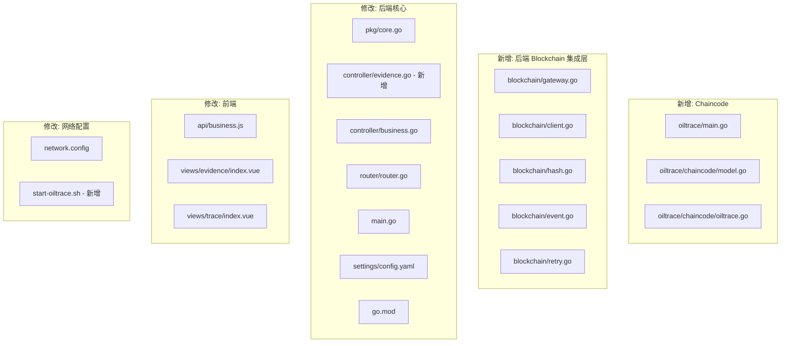

# Fabric v2.5 真实集成 — 完工文档

## 变更总览



## 编译验证结果

| 组件 | 命令 | 结果 |
|---|---|---|
| **后端** (Go) | `go build ./...` | ✅ 成功 |
| **链码** (Go) | `go build ./...` | ✅ 成功 |
| **依赖** | `go mod tidy` | ✅ 成功 |

---

## 新增文件

### 1. Chaincode — `blockchain/chaincode/oiltrace/`

| 文件 | 说明 |
|---|---|
| [go.mod](file:///c:/Users/Xie_Jinglong/Desktop/Blockchain-Based%20Supervision%20Framework%20for%20Edible%20Oil%20Transportation/blockchain/chaincode/oiltrace/go.mod) | 链码 Go 模块定义 |
| [main.go](file:///c:/Users/Xie_Jinglong/Desktop/Blockchain-Based%20Supervision%20Framework%20for%20Edible%20Oil%20Transportation/blockchain/chaincode/oiltrace/main.go) | 链码入口，注册 `OilTraceContract` |
| [chaincode/model.go](file:///c:/Users/Xie_Jinglong/Desktop/Blockchain-Based%20Supervision%20Framework%20for%20Edible%20Oil%20Transportation/blockchain/chaincode/oiltrace/chaincode/model.go) | 链上数据模型：`ChainEvent`, `VerifyResult`, `TraceIndex` |
| [chaincode/oiltrace.go](file:///c:/Users/Xie_Jinglong/Desktop/Blockchain-Based%20Supervision%20Framework%20for%20Edible%20Oil%20Transportation/blockchain/chaincode/oiltrace/chaincode/oiltrace.go) | 4 个核心接口：`RecordEvent`/`GetEvent`/`GetTraceEvents`/`VerifyEvent` |

**链码功能**：
- `RecordEvent` — 写入存证，自动填充 TxID/TxTime/SubmitterMSP，创建复合键索引
- `GetEvent` — 按 eventID 查询单条
- `GetTraceEvents` — 按溯源码查全部事件（复合键部分查询）
- `VerifyEvent` — 比对传入哈希与链上哈希

---

### 2. 后端 Blockchain 集成层 — `application/backend/blockchain/`

| 文件 | 说明 |
|---|---|
| [gateway.go](file:///c:/Users/Xie_Jinglong/Desktop/Blockchain-Based%20Supervision%20Framework%20for%20Edible%20Oil%20Transportation/application/backend/blockchain/gateway.go) | Fabric Gateway 连接管理，支持双组织 (Org1+Org2) |
| [client.go](file:///c:/Users/Xie_Jinglong/Desktop/Blockchain-Based%20Supervision%20Framework%20for%20Edible%20Oil%20Transportation/application/backend/blockchain/client.go) | 4 个 Chaincode 调用封装 |
| [hash.go](file:///c:/Users/Xie_Jinglong/Desktop/Blockchain-Based%20Supervision%20Framework%20for%20Edible%20Oil%20Transportation/application/backend/blockchain/hash.go) | 确定性 JSON + SHA-256 哈希计算 |
| [event.go](file:///c:/Users/Xie_Jinglong/Desktop/Blockchain-Based%20Supervision%20Framework%20for%20Edible%20Oil%20Transportation/application/backend/blockchain/event.go) | 链上事件构建器 |
| [retry.go](file:///c:/Users/Xie_Jinglong/Desktop/Blockchain-Based%20Supervision%20Framework%20for%20Edible%20Oil%20Transportation/application/backend/blockchain/retry.go) | 后台重试工作器 |

### 3. 新增 API 控制器

| 文件 | 说明 |
|---|---|
| [controller/evidence.go](file:///c:/Users/Xie_Jinglong/Desktop/Blockchain-Based%20Supervision%20Framework%20for%20Edible%20Oil%20Transportation/application/backend/controller/evidence.go) | 5 个新接口：核验/重试/链上查询/溯源码查询/Fabric 状态 |

### 4. 网络部署脚本

| 文件 | 说明 |
|---|---|
| [start-oiltrace.sh](file:///c:/Users/Xie_Jinglong/Desktop/Blockchain-Based%20Supervision%20Framework%20for%20Edible%20Oil%20Transportation/blockchain/network/start-oiltrace.sh) | 一键启动 Fabric 网络 + 部署链码 + 验证 |

---

## 修改的文件

### 后端

| 文件 | 关键变更 |
|---|---|
| [core.go](file:///c:/Users/Xie_Jinglong/Desktop/Blockchain-Based%20Supervision%20Framework%20for%20Edible%20Oil%20Transportation/application/backend/pkg/core.go) | `evidence_records` 表增加 11 个 Fabric 字段；`CreateEvidence` 从模拟哈希改为真实异步 Fabric 提交 |
| [business.go](file:///c:/Users/Xie_Jinglong/Desktop/Blockchain-Based%20Supervision%20Framework%20for%20Edible%20Oil%20Transportation/application/backend/controller/business.go) | `ListEvidence` 和 `evidenceByBatch` 返回新 Fabric 字段 |
| [router.go](file:///c:/Users/Xie_Jinglong/Desktop/Blockchain-Based%20Supervision%20Framework%20for%20Edible%20Oil%20Transportation/application/backend/router/router.go) | 新增 5 个 API 路由 |
| [main.go](file:///c:/Users/Xie_Jinglong/Desktop/Blockchain-Based%20Supervision%20Framework%20for%20Edible%20Oil%20Transportation/application/backend/main.go) | 初始化 Fabric Gateway + 启动重试工作器 |
| [config.yaml](file:///c:/Users/Xie_Jinglong/Desktop/Blockchain-Based%20Supervision%20Framework%20for%20Edible%20Oil%20Transportation/application/backend/settings/config.yaml) | 新增 `fabric` 配置节 |
| [go.mod](file:///c:/Users/Xie_Jinglong/Desktop/Blockchain-Based%20Supervision%20Framework%20for%20Edible%20Oil%20Transportation/application/backend/go.mod) | Go 1.22，添加 `fabric-gateway` + `grpc` |

### 前端

| 文件 | 关键变更 |
|---|---|
| [api/business.js](file:///c:/Users/Xie_Jinglong/Desktop/Blockchain-Based%20Supervision%20Framework%20for%20Edible%20Oil%20Transportation/application/web/src/api/business.js) | 新增 `verifyEvidence`, `retryEvidence`, `queryChainEvent`, `fabricStatus` |
| [evidence/index.vue](file:///c:/Users/Xie_Jinglong/Desktop/Blockchain-Based%20Supervision%20Framework%20for%20Edible%20Oil%20Transportation/application/web/src/views/evidence/index.vue) | 完整重写：上链状态标签、TxID/区块号显示、哈希核验弹窗、重新上链按钮 |
| [trace/index.vue](file:///c:/Users/Xie_Jinglong/Desktop/Blockchain-Based%20Supervision%20Framework%20for%20Edible%20Oil%20Transportation/application/web/src/views/trace/index.vue) | 时间线增加上链状态标签、TxID、区块号、链上详情弹窗 |

### 网络配置

| 文件 | 关键变更 |
|---|---|
| [network.config](file:///c:/Users/Xie_Jinglong/Desktop/Blockchain-Based%20Supervision%20Framework%20for%20Edible%20Oil%20Transportation/blockchain/network/network.config) | 默认 channel 改为 `oiltracechannel`，chaincode 改为 `oiltrace` |

---

## 新增 API 接口

| 方法 | 路径 | 权限 | 说明 |
|---|---|---|---|
| GET | `/api/evidence/verify/:id` | 所有业务角色+监管 | 核验存证哈希一致性 |
| POST | `/api/evidence/retry` | 监管机构/管理员 | 重新提交失败记录 |
| GET | `/api/evidence/chain/:event_id` | 所有业务角色+监管 | 查询链上原始数据 |
| GET | `/api/evidence/trace/:code` | 所有业务角色+监管 | 按溯源码查全部链上存证 |
| GET | `/api/fabric/status` | 监管机构/管理员 | Fabric 网络状态+存证统计 |

---

## 你需要执行的操作

### 第一步：安装 WSL Ubuntu（如果还没有的话）

```powershell
wsl --install -d Ubuntu
```

> Fabric 网络脚本 (network.sh) 是 Bash 脚本，需要在 Linux 环境下运行。

### 第二步：进入 WSL，启动 Fabric 网络

```bash
# 在 WSL 中
cd /mnt/c/Users/Xie_Jinglong/Desktop/Blockchain-Based\ Supervision\ Framework\ for\ Edible\ Oil\ Transportation/blockchain/network

# 赋予执行权限
chmod +x start-oiltrace.sh network.sh scripts/*.sh

# 一键启动
./start-oiltrace.sh
```

### 第三步：启动后端（Windows PowerShell）

```powershell
cd "C:\Users\Xie_Jinglong\Desktop\Blockchain-Based Supervision Framework for Edible Oil Transportation\application\backend"
go run main.go
```

### 第四步：启动前端

```powershell
cd "C:\Users\Xie_Jinglong\Desktop\Blockchain-Based Supervision Framework for Edible Oil Transportation\application\web"
npm run dev
```

### 第五步：验证

1. 登录系统，以原料供应商身份创建并提交一个批次
2. 进入 **区块链存证查询** 页面
3. 确认看到存证记录的上链状态变为 **已上链**（绿色标签）
4. 点击 **哈希核验** 按钮，确认显示 **数据一致**
5. 进入 **产品全流程追溯** 页面，确认时间线显示 TxID 和区块号

> [!NOTE]
> 如果 Fabric 网络未启动，系统会自动进入"离线模式"——所有业务操作正常运行，存证记录保持 `pending` 状态，等网络恢复后由重试工作器自动上链。
